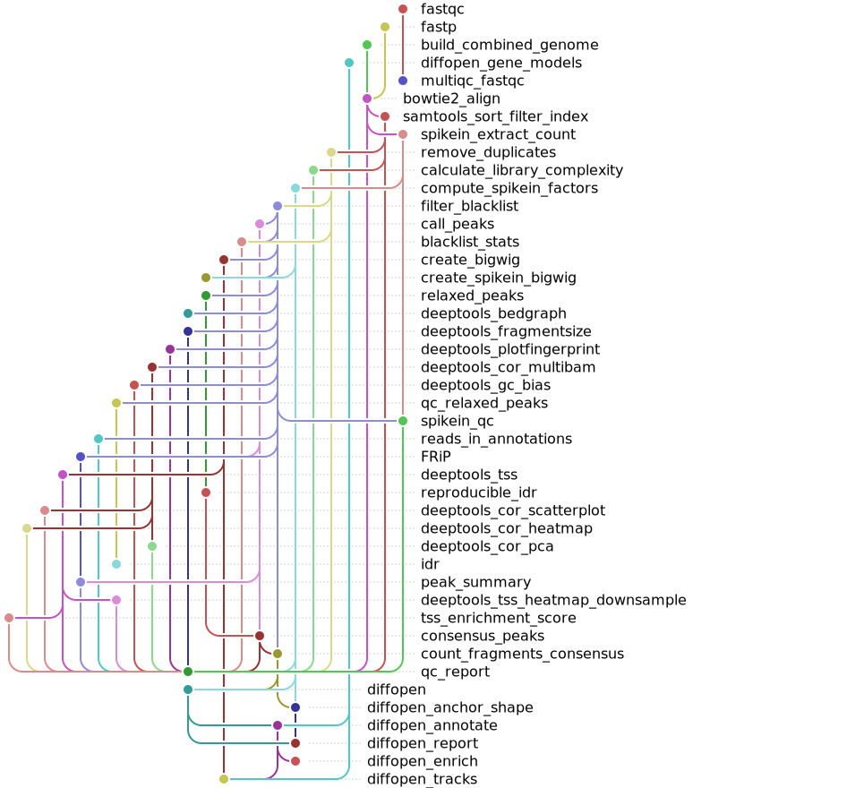

[](https://github.com/gynecoloji/snakemake_ATACseq_spikein/actions/workflows/ci.yml)
[](https://doi.org/10.5281/zenodo.21350287)

## Citation

If you use this workflow in your research, please cite it. Use the **"Cite this
repository"** button on the GitHub repository page (generated from
[`CITATION.cff`](CITATION.cff)), or cite the archived release on Zenodo via the DOI
badge above — the concept DOI always resolves to the latest version.

**Please also cite the individual tools used:**
- **Snakemake**: Köster, J. and Rahmann, S. (2012). Snakemake—a scalable bioinformatics workflow engine. Bioinformatics, 28(19), 2520-2522.
- **MACS2**: Zhang, Y. et al. (2008). Model-based analysis of ChIP-Seq (MACS). Genome Biology, 9, R137.
- **deepTools**: Ramírez, F. et al. (2016). deepTools2: a next generation web server for deep-sequencing data analysis. Nucleic Acids Research, 44(W1), W160-W165.
- **Bowtie2**: Langmead, B. and Salzberg, S.L. (2012). Fast gapped-read alignment with Bowtie 2. Nature Methods, 9, 357-359.
- **SAMtools**: Li, H. et al. (2009). The Sequence Alignment/Map format and SAMtools. Bioinformatics, 25(16), 2078-2079.
- **IDR**: Li, Q. et al. (2011). Measuring reproducibility of high-throughput experiments. Annals of Applied Statistics, 5(3), 1752-1779.
- **featureCounts (Subread)**: Liao, Y. et al. (2014). featureCounts: an efficient general purpose program for assigning sequence reads to genomic features. Bioinformatics, 30(7), 923-930.
- **Consensus peaks (fixed-width / score-per-million)**: Corces, M.R. et al. (2018). The chromatin accessibility landscape of primary human cancers. Science, 362(6413), eaav1898.
- **BEDTools**: Quinlan, A.R. and Hall, I.M. (2010). BEDTools: a flexible suite of utilities for comparing genomic features. Bioinformatics, 26(6), 841-842.
- **FastQC**: Andrews, S. (2010). FastQC: a quality control tool for high throughput sequence data.
- **fastp**: Chen, S. et al. (2018). fastp: an ultra-fast all-in-one FASTQ preprocessor. Bioinformatics, 34(17), i884-i890.

## License

This project is licensed under the MIT License - see the LICENSE file for details.

## Contact

**Author**: gynecoloji  
**Project Repository**: [https://github.com/gynecoloji/snakemake_ATACseq_spikein](https://github.com/gynecoloji/snakemake_ATACseq_spikein)

For questions, issues, or feature requests, please:
1. Check the existing [Issues](https://github.com/gynecoloji/snakemake_ATACseq_spikein/issues) on GitHub
2. Submit a new issue with detailed information about your problem
3. Include relevant log files and system information for troubleshooting

## Acknowledgments

This pipeline was developed based on best practices from the ENCODE consortium and incorporates methodologies from multiple published ATAC-seq analysis workflows. Special thanks to the developers of all the integrated tools that make this comprehensive analysis possible.

---

**Note**: This pipeline is optimized for human genome analysis (hg38) but can be adapted for other organisms by updating reference files and parameters accordingly. It supports Active Motif–style spike-in normalization (e.g. Drosophila) via a concatenated human + spike-in Bowtie2 alignment.# ATAC-seq Analysis Pipeline

A comprehensive Snakemake workflow for processing and analyzing ATAC-seq data from raw reads to peak calling with extensive quality control metrics and differential binding analysis.

## Overview

This pipeline integrates three complementary components for complete ATAC-seq analysis:

1. **Primary ATAC-seq stage** (`atacseq_all` target) - Raw FASTQ → concatenated (human + spike-in) Bowtie2 alignment → filtering → MACS2 peak calling → **spike-in normalization** (scaled bigWigs) → a reproducible, fixed-width **consensus peak set** with a fragment-count matrix
2. **ATAC-seq QC stage** (`qc_all` target) - deepTools QC, FRiP, IDR, library complexity, spike-in QC, TSS enrichment score, a self-contained **interactive HTML QC report** (all QC except FastQC), plus a FastQC-only MultiQC

Both stages live in a single standard-layout `workflow/Snakefile`: one `snakemake --use-conda` run builds the primary stage **and** the QC report in dependency order (unified DAG). Run a subset with the `atacseq_all` or `qc_all` targets. The layout follows the [Snakemake Workflow Catalog](https://snakemake.github.io/snakemake-workflow-catalog/) conventions, so the workflow can be deployed into another project with `snakedeploy deploy-workflow` (see [Deploying with snakedeploy](#deploying-with-snakedeploy)).
3. **Differential openness stage** (`diffopen_all` target, R / DESeq2) - differential accessibility over the consensus count matrix under **selectable normalizations** (none / spike-in / constitutive-CTCF / RNA-stable / anchor+shape hybrid), so you can see how much the answer depends on the normalization choice

## Workflow Diagram

The workflow rule graph, rendered as a "tube map" with
[snakevision](https://github.com/OpenOmics/snakevision):



The same tube map is rendered automatically on the
[Snakemake Workflow Catalog page](https://snakemake.github.io/snakemake-workflow-catalog/?usage=gynecoloji/snakemake_ATACseq_spikein)
from the executable test case in [`.test/`](.test). Regenerate it with:

```bash
# Name the targets BEFORE --rulegraph: the flag takes an optional value and will
# otherwise swallow the first target name. `diffopen_all` is needed explicitly —
# the default target excludes the opt-in differential stage, so without it the
# diffopen rules are missing from the map.
snakemake -s workflow/Snakefile -c 1 -d .test all diffopen_all --forceall --rulegraph > rulegraph.dot
snakevision -s all atacseq_all qc_all diffopen_all -o images/rulegraph.svg rulegraph.dot
```

(The catalog page renders only the default target, so it shows the primary + QC
stages; the image above additionally covers the opt-in differential stage.)

## Features

- **Complete end-to-end processing** of paired-end ATAC-seq data
- **Spike-in normalization** (Active Motif–style) via a concatenated human + spike-in genome, with spike-in-scaled bigWig tracks
- **Concatenated Bowtie2 alignment** with per-read genome assignment (no cross-mapping double-counting)
- **Chromosome control**: align to a configurable set (default chr1–22, chrX, chrM), record mitochondrial-% QC, then keep only the analysis chromosomes
- **Reproducible consensus peaks** (Corces-2018 fixed-width / score-per-million; majority-vote or IDR reproducibility) + a **featureCounts** fragment matrix for differential analysis
- **Blacklist region filtering** for removal of technical artifacts
- **Extensive QC metrics** (fragment size, TSS heatmap + numeric enrichment score, fingerprint, correlation/PCA, GC bias, FRiP, NRF/PBC1/PBC2, spike-in %, reads in promoters/enhancers)
- **Interactive HTML QC report** (self-contained, theme-aware; all QC except FastQC) + a FastQC-only MultiQC
- **Signal track generation** (bigWig, bedGraph) for visualization
- **Conda environment management** (one env per rule) plus a ready-to-run **Docker / Apptainer** image

## Pipeline Components

### 1. Primary Processing Pipeline (`atacseq_all` target)

**Processing Steps:**
```
Raw FASTQ → FastQC → fastp
  → build combined (human + spike-in) Bowtie2 index
  → Bowtie2 alignment (one pass to the combined genome)
     ├─ human reads   → unique + properly-paired filter → mito-% QC → keep chr1–22/chrX
     │                  → Picard dedup → blacklist filter → MACS2 peaks
     │                  → spike-in-scaled + depth-normalized bigWigs
     │                  → consensus peaks → featureCounts fragment matrix
     └─ spike-in reads → dedup → count → normalization factor
```

**Key Features:**
- Quality assessment with FastQC; read trimming/filtering with fastp
- **Concatenated alignment** to human + spike-in with Bowtie2; reads are split by genome (spike-in chroms are prefixed), so each read is assigned to exactly one genome
- Uniquely-mapped, properly-paired filtering; filtering-orphaned mates removed; **mitochondrial-% recorded** then non-primary chromosomes dropped
- Picard duplicate removal + fragment-level ENCODE blacklist filtering
- MACS2 peak calling (BAMPE)
- **Spike-in normalization**: `NF = min(spike-in reads) / spike-in reads`, applied as a bigWig scale factor
- **Consensus peaks** (fixed-width, SPM-ranked; majority-vote/IDR reproducibility) + **featureCounts** matrix

### 2. Quality Control Pipeline (`qc_all` target)

**Comprehensive QC Metrics** (run after the primary pipeline; consumes its `results/`):
- **Fragment Size Analysis** - Insert size distribution and nucleosomal patterns
- **TSS Enrichment** - Heatmap/profile **and a numeric per-sample enrichment score**
- **Signal Quality** - Fingerprint plots for signal-to-noise assessment
- **Sample Correlation** - Multi-sample correlation heatmap/scatter and PCA
- **GC Bias Assessment** - Sequence composition bias evaluation
- **FRiP Scores** - Fraction of Reads in Peaks
- **Library Complexity** - PCR bottlenecking assessment (NRF, PBC1, PBC2)
- **IDR Analysis** - Irreproducible Discovery Rate on relaxed peak calls, per replicate pair
- **Spike-in QC** - Spike-in % per sample vs the Active Motif 2–10% target
- **Peak + annotation summary** - Peak counts/widths and reads in promoters vs enhancers
- **Interactive HTML QC report** (`atacseq_qc_report.html`) - one self-contained, theme-aware page for all QC **except FastQC** (alignment rate, mito %, duplication, blacklist, spike-in %/norm factors, peaks/FRiP, TSS enrichment, NRF/PBC1/PBC2, fragment size/GC/correlation/PCA/fingerprint, reads-in-annotation, consensus), with ENCODE-threshold pass/warn/fail flags; numeric metrics render as interactive tables/bar charts and the deepTools QC (fragment size, GC bias, correlation/PCA, fingerprint, TSS profile + per-region heatmap) renders as **interactive SVG/canvas charts drawn client-side** — nothing is embedded as a static image. Mitochondrial % comes from the primary pipeline's `idxstats`
- **FastQC MultiQC report** (`multiqc_fastqc.html`) - MultiQC scoped to FastQC (raw-read quality) only

### 3. Differential Openness (`diffopen_all` target)

DESeq2 differential accessibility over the consensus matrix, with the normalization
as an explicit, swappable choice, split by promoter/enhancer and carried through to
gene assignment, GO enrichment, Gviz browser tracks and a self-contained HTML
report. See [Differential Openness](#differential-openness-opt-in-r--deseq2) for the
available modes and how to compare them.

## Requirements

The pipeline requires the following dependencies:

- [Snakemake](https://snakemake.readthedocs.io/) ≥7.0.0
- [Conda](https://docs.conda.io/en/latest/) / [Mamba](https://github.com/mamba-org/mamba) (recommended)
- [Python](https://www.python.org/) ≥3.8
- UNIX-based system (Linux/MacOS)

### Software Dependencies
(automatically installed via conda environments):
- **FastQC** (quality control)
- **fastp** (read trimming)
- **Bowtie2** (alignment to the concatenated human + spike-in genome)
- **SAMtools** (BAM processing, read splitting, idxstats)
- **Picard** (duplicate removal)
- **MACS2** (peak calling)
- **deepTools** (bigWig/bedGraph, QC and visualization)
- **bedtools** + **bc** (genomic interval operations; FRiP / complexity / annotation)
- **IDR** (reproducibility analysis)
- **featureCounts / Subread** (fragment quantification over the consensus set)

### Differential-openness environment (R / Bioconductor)
The `diffopen_*` rules run in `workflow/envs/r-diffopen.yaml`, created automatically
by `--use-conda` and pre-built into the container:
- **DESeq2**, **apeglm** — differential testing + log2FC shrinkage
- **GenomicRanges** / **IRanges** — constitutive-CTCF anchor overlap

### Reference Files (`ref/`)

Files fall into three groups: **shipped** with the repo (present after clone),
**downloaded** from public sources, and **generated** locally from the downloads.
Exact commands are in [Reference files: download & generate](#reference-files-download--generate).

```
ref/
├── config.yaml                          # pipeline configuration                 (shipped)
├── samples.csv                          # sample sheet: sample_id,type,group      (shipped; you edit)
│
│  ── downloaded (public sources; not in the repo) ──
├── hg38.fa                              # human genome FASTA (UCSC, chr-prefixed)
├── dm6.fa                               # spike-in genome FASTA (e.g. Drosophila)
├── hg38.2bit                            # human genome 2bit (QC: GC bias)
├── gencode.v36.annotation.gtf           # GENCODE annotation (TSS, gene models)
├── FANTOM5_CAGE_peaks_hg38.bed.gz       # FANTOM5 CAGE peaks (optional; only to rebuild the CAGE set)
├── picard.jar                           # Picard (MarkDuplicates)
│
│  ── shipped, or generated from the downloads ──
├── hg38_blacklist_regions.bed           # ENCODE hg38 blacklist v2                (shipped)
├── hg38.fa.fai                          # faidx of hg38.fa                        (generated)
├── promoter_chr1-22X.bed                # Ensembl Regulatory Build promoters      (shipped; QC reads-in-annotation)
├── enhancer_chr1-22X.bed                # Ensembl Regulatory Build enhancers      (shipped; QC reads-in-annotation)
├── Promoter_uniqueTSS_hg38_{3000,5000}bp_chr1-22X.bed      # TSS±N, unique TSS          (shipped)
├── Promoter_MANEcanonical_hg38_{3000,5000}bp_chr1-22X.bed  # TSS±N, one per gene (MANE) (shipped)
├── Promoter_FANTOM5CAGE_hg38_{3000,5000}bp_chr1-22X.bed    # TSS±N, empirical CAGE      (shipped)
│      # per-transcript set (Promoter_UCSC_hg38_*bp) not shipped — `build_promoter_beds.py transcript`
├── COMBINED/                            # combined human+spike-in Bowtie2 index   (built by the pipeline)
│
│  ── shipped scripts ──
├── build_promoter_beds.py               # regenerates the promoter TSS BEDs (4 definitions)
├── build_constitutive_ctcf.py           # regenerates the constitutive-CTCF anchor BED
├── build_qc_report.py  tss_score.py  consensus_peaks.py  process_sam.py
├── compute_spikein_factors.py  blacklist-stats-script.py  downsample_tss_matrix.py
└── diffopen.R  spikein_anchor_shape.R   # differential openness (5 normalizations)
```

### Reference files: download & generate

Only the **downloaded** files are absent after a clone. Fetch them into `ref/`, then
build the small derived files. Everything else ships with the repo.

**1. Download** (run from the repo root):

```bash
cd ref

# Human + spike-in genomes and the human 2bit (UCSC goldenPath)
curl -O https://hgdownload.soe.ucsc.edu/goldenPath/hg38/bigZips/hg38.fa.gz && gunzip hg38.fa.gz
curl -O https://hgdownload.soe.ucsc.edu/goldenPath/dm6/bigZips/dm6.fa.gz   && gunzip dm6.fa.gz
curl -O https://hgdownload.soe.ucsc.edu/goldenPath/hg38/bigZips/hg38.2bit

# GENCODE v36 gene annotation
curl -O http://ftp.ebi.ac.uk/pub/databases/gencode/Gencode_human/release_36/gencode.v36.annotation.gtf.gz
gunzip gencode.v36.annotation.gtf.gz

# FANTOM5 robust CAGE peaks (hg38) — OPTIONAL: only needed to rebuild the CAGE
# promoter set (the built Promoter_FANTOM5CAGE_*.bed already ships with the repo)
curl -L -o FANTOM5_CAGE_peaks_hg38.bed.gz \
  "https://fantom.gsc.riken.jp/5/datafiles/reprocessed/hg38_latest/extra/CAGE_peaks/hg38_fair+new_CAGE_peaks_phase1and2.bed.gz"

# Picard (MarkDuplicates)
curl -L -o picard.jar https://github.com/broadinstitute/picard/releases/latest/download/picard.jar

cd ..
```

The ENCODE blacklist ships with the repo; to refresh it (Boyle Lab v2):

```bash
curl -L https://github.com/Boyle-Lab/Blacklist/raw/master/lists/hg38-blacklist.v2.bed.gz \
  | gunzip > ref/hg38_blacklist_regions.bed
```

**2. Generate** (needs the downloads above; run from the repo root):

```bash
# faidx of the human genome (used to clamp promoter windows to chromosome ends)
samtools faidx ref/hg38.fa

# The promoter TSS BEDs (unique / MANE / CAGE) already ship with the repo. Rebuild
# them only after updating the GTF, or to also produce the per-transcript set:
python workflow/scripts/build_promoter_beds.py all   # modes: unique | mane | cage | transcript | all
# (needs ref/hg38.fa.fai + the GTF; the `cage` mode also needs the FANTOM5 download above)
# Kept chromosomes default to `keep_chroms` in config/config.yaml (currently chr1-22,X);
# override per run with e.g. --chroms chr1,chr2,chrX  or  --chroms all  (the filename
# scope token, e.g. chr1-22X, auto-adjusts; set it explicitly with --label).

# The combined human+spike-in Bowtie2 index (ref/COMBINED/) is built automatically
# by the pipeline's build_combined_genome rule from hg38.fa + dm6.fa — no manual step.
```

The QC annotation BEDs (`promoter_chr1-22X.bed`, `enhancer_chr1-22X.bed`) ship with the
repo. They are **Ensembl Regulatory Build** features (`feature_type` Promoter / Enhancer,
`ENSR*` IDs), chr-prefixed and restricted to chr1–22,X. To rebuild from a newer release,
download the regulatory GFF from
`http://ftp.ensembl.org/pub/current_regulation/homo_sapiens/`, keep the Promoter /
Enhancer features, and emit `chrom start end ENSR_id`.

### Promoter / TSS definitions

`build_promoter_beds.py` writes promoter windows (TSS ±3kb and ±5kb, strand-aware,
chr1–22,X) under four TSS definitions so you can match the definition to the analysis.
All windows are symmetric width 2N; GTF-derived sets keep a 10-column layout
(`tx_id chrom start end score strand tx_id.ver transcript_type gene_name gene_id`),
CAGE is BED6.

| `mode` | TSS = | Windows (chr1–22,X) | Use when |
|---|---|---|---|
| `transcript` | every transcript's 5′ end (GENCODE v36) | 231,104 | you want all annotated alternative promoters (one per isoform; ChIPseeker-style) |
| `unique` | distinct (chrom, TSS, strand) tuples | 205,696 | as `transcript`, without isoform double-counting |
| `mane` | one canonical TSS per gene (MANE Select, else 5′-most) | 60,058 | one row per gene; ENCODE-comparable TSS-enrichment reference |
| `cage` | FANTOM5 robust CAGE peak position (empirical) | 209,146 | data-defined start sites, incl. promoters annotation misses |

The repo ships the **`unique`, `mane`, and `cage`** sets (each at ±3kb and ±5kb); the
per-transcript set is generate-on-demand (`build_promoter_beds.py transcript`).

Cross-check: **90.6%** of protein-coding MANE-canonical TSSs have a FANTOM5 CAGE peak
within 500 bp (strong annotation↔empirical agreement); non-coding genes only **24.9%**
(lncRNAs etc. are largely CAGE-silent). Note that each transcript has exactly one TSS,
whereas a gene can have several — the pipeline's deepTools TSS-enrichment QC and the
`ChIPseeker` peak annotation both use **transcript-level** TSS by default.

## Installation

```bash
# Clone the repository
git clone https://github.com/gynecoloji/snakemake_ATACseq_spikein.git
cd snakemake_ATACseq_spikein

# You need Snakemake + conda/mamba as the driver. The per-rule tool environments
# (workflow/envs/*.yaml) are created automatically on the first `--use-conda` run —
# you do not build them by hand.
mamba create -n atacseq -c conda-forge -c bioconda snakemake-minimal pandas
conda activate atacseq
```

> **No local install?** Skip all of the above and use the container image instead —
> see [Container Execution (Docker / Apptainer)](#container-execution-docker--apptainer).

## Configuration

All parameters live in `config/config.yaml`, which ships with working defaults and
an inline comment on each one. The [config schema](workflow/schemas/config.schema.yaml)
is the **single source of truth** for parameter types, defaults, and descriptions:
the workflow validates your config against it on every run (and fills in defaults
for anything you omit), and the
[Snakemake Workflow Catalog](https://snakemake.github.io/snakemake-workflow-catalog/?usage=gynecoloji/snakemake_ATACseq_spikein)
renders it as a parameter table on the workflow page. See
[`config/README.md`](config/README.md) for the sample sheet and reference-data details.

At minimum, point the reference-file paths at the genomes/annotation you provide
(see [Data Preparation](#data-preparation)):

```yaml
samples_table: "config/samples.csv"                # sample sheet (sample_id, type, group)
human_fasta:   "ref/hg38.fa"                       # chr-prefixed UCSC hg38 (you provide)
spikein_fasta: "ref/dm6.fa"                        # spike-in genome, ANY species (you provide)
gtf:           "ref/gencode.v36.annotation.gtf"    # GENCODE, chr-prefixed (for TSS-enrichment QC)
```

To switch spike-in species, change `spikein_fasta` (the combined index is rebuilt
automatically).

## Data Preparation

### Input Files
Please pay attention to the **common suffix** of the fastq related raw files (_R1/2_001.fastq.gz)
Accepted file format should look like: **sample_id**+**common suffix** (e.g. GSF4007-Control_1_S11_R1_001.fastq.gz)

Place paired-end FASTQ files in the `data/` directory following this naming convention:
```
data/{sample}_R1_001.fastq.gz
data/{sample}_R2_001.fastq.gz
```

### Sample Information

Create `config/samples.csv`:
```csv
sample_id,type,group
GSF4007-Control_1_S11,Control,group1
GSF4007-Control_2_S13,Control,group1
GSF4007-Control_3_S15,Control,group1
GSF4007-NICD3-V5_1_S12,NICD3,group2
GSF4007-NICD3-V5_2_S14,NICD3,group2
GSF4007-NICD3-V5_3_S16,NICD3,group2
```

The `group` column defines conditions / replicate sets. It drives **consensus-peak
reproducibility** (≥2-of-N majority vote for ≥3-replicate conditions, or IDR for
2-replicate conditions) and pairwise IDR in the QC pipeline.

## Running the Pipeline

The workflow is the standard-layout `workflow/Snakefile`. A single run builds the
primary stage **and** the QC report in dependency order (unified DAG); use the
`atacseq_all` / `qc_all` targets to run just one stage. Snakemake auto-discovers
`workflow/Snakefile` when run from the repo root, so `-s workflow/Snakefile` is
optional but shown here for clarity.

### Dry Run

To check the workflow without executing any commands:
```bash
# Check the whole workflow (primary → QC)
snakemake -s workflow/Snakefile -n

# Or check a single stage
snakemake -s workflow/Snakefile -n atacseq_all
snakemake -s workflow/Snakefile -n qc_all
```

### Local Execution

```bash
# Run everything (primary stage → QC report) in one dependency-ordered DAG
snakemake -s workflow/Snakefile --use-conda --cores 20

# Or run a single stage
snakemake -s workflow/Snakefile --use-conda --cores 20 atacseq_all   # primary only
snakemake -s workflow/Snakefile --use-conda --cores 20 qc_all        # QC only (after primary)
```

### Differential Openness (opt-in, R / DESeq2)

A differential-accessibility stage over the consensus count matrix, with a
**selectable normalization** so you can see how much the answer depends on it.
It is **not** part of the default target (it needs ≥2 conditions in
`config/samples.csv`); request it explicitly:

```bash
# every configured normalization, one directory each under results/diffopen/
snakemake -s workflow/Snakefile --use-conda --cores 8 diffopen_all

# or just the hybrid on its own
snakemake -s workflow/Snakefile --use-conda --cores 8 diffopen_anchor_shape
```

| mode | size factors from | detects a true global shift? |
|---|---|---|
| `none` | DESeq2 median-of-ratios over **all** peaks (baseline) | No — global change defined as zero |
| `spikein` | **Drosophila spike-in** read depth | **Yes** — but only if the spike-in is trustworthy |
| `ctcf` | median-of-ratios restricted to **constitutive CTCF anchors** (`ctcf_bed`), spike-in free | No — CTCF level assumed invariant |
| `rnastable` | median-of-ratios restricted to **promoter peaks of RNA-seq-stable genes** (`diffopen_rna_table`), spike-in free — *opt-in* | No — stable-gene level assumed invariant |
| `anchor_shape` | hybrid: **level** from the spike-in, intensity-dependent **shape** from CTCF anchors (anchors that move are trimmed) | Yes, with a shape correction |

**Compare the `run_summary.txt` files before trusting any single mode** — a large
size-factor spread that tracks condition means that normalization is confounded.
(In our GSF4007 data the spike-in factors spanned 5× and separated by condition,
which is why the spike-in-free `ctcf` mode exists.)

#### Promoter / enhancer split

Every mode — including the hybrid — also fits **promoter** and **enhancer** peaks
separately, classified by overlap with `promoter_bed` / `enhancer_bed` under
**promoter precedence** (a peak hitting both counts as promoter, never twice).
Each class gets its own dispersion trend and its own within-class FDR; the size
factors (or, for `anchor_shape`, the per-region offset matrix) are **never**
re-estimated per class — they are a library-level property computed once on all
peaks. Because the offsets are row-centered, taking one class's rows is exactly
the normalization the genome-wide fit applied to those same regions.

Alongside each table, pre-filtered `*_nominal_p05.tsv` / `*_nominal_p01.tsv`
subsets are written. At n=3 DESeq2's per-peak FDR is very conservative, so read
these sets for their **up/down direction balance**, not their size — the
`run_summary.txt` table carries a footnote explaining how to read the `% up`
column and which values indicate a scaling artifact rather than biology.

#### Downstream: genes, enrichment, browser tracks, report

`diffopen_all` continues past the DA tables for every mode:

| stage | rule | output |
|---|---|---|
| Gene assignment | `diffopen_annotate` | `<mode>/genes/` — nearest **transcript** TSS (not gene-level 5′ ends, which misassign long genes), reported for any biotype and separately for protein-coding; per class × tier annotation tables, up/down gene lists, and the enrichment universe |
| GO enrichment | `diffopen_enrich` | `<mode>/enrichment/` — clusterProfiler + `org.Hs.eg.db`, offline (no network call at runtime); `GO_<class>_<tier>_<up\|down>.tsv/.png` plus `enrichment_summary.tsv` |
| Browser tracks | `diffopen_tracks` | `<mode>/tracks/gviz_<class>_<up\|down>_<GENE>.png/.pdf` — per-sample coverage, GENCODE models, and the differential region highlighted |
| HTML summary | `diffopen_report` | `results/diffopen/diffopen_report.html` — self-contained (inline SVG, no external assets), comparing every normalization that ran side by side with a verdict panel |

> ⚠️ **Track heights are not the effect size.** The Gviz panels read
> `results/bigwig/` — deepTools `--normalizeUsing RPGC` (1× depth), the **same
> normalization for every mode**. They are *not* rescaled by the mode's size
> factors, so read them as *where the signal is*; the `log2FoldChange_MLE`
> column is the quantitative statement.
>
> This is unavoidable for `anchor_shape`. The other modes have a per-sample
> **scalar** size factor, so a bigWig could in principle be rescaled to match
> them. The hybrid's normalization is a **G×n matrix** —
> `log2 NF_gi = shape_i(A_g) − o_i`, where `shape_i()` is evaluated at each
> region's own mean intensity `A_g`. Two regions in the same sample get
> different corrections, so no single scale factor exists and a plain bigWig
> cannot represent it. (`results/spikein_bigwig/` holds spike-in-scaled tracks
> — the level term `o_i` only, without the shape correction — if you want a
> closer visual match at the cost of leaving the intensity dependence in.)

Three significance tiers are carried through: `padj05` (padj < 0.05), `p01`
(p < 0.01) and `p05` (p < 0.05). Enrichment and tracks are **gated** — a set with
`≤ diffopen_min_genes` genes is skipped, since small sets give unstable,
uninterpretable enrichment. At small n the `padj05` tier normally falls below the
gate by design. The universe is the coding genes reachable from any *tested* peak,
not the whole genome, which would inflate significance.

Relevant config keys:

| key | default | meaning |
|---|---|---|
| `diffopen_modes` | `[none, spikein, ctcf]` | which size-factor modes to run (add `rnastable` to enable it; the hybrid always runs) |
| `diffopen_ref_label` | `Control` | reference level of the `type` column |
| `diffopen_min_genes` | `10` | gate: skip enrichment/tracks for sets at or below this |
| `diffopen_go_ont` | `BP` | GO ontology (`BP`/`MF`/`CC`) |
| `diffopen_track_tier` | `p01` | which tier to draw Gviz tracks for |
| `diffopen_track_top` | `5` | top N up and N down regions per class |
| `diffopen_rna_table` | *(unset)* | RNA-seq DESeq2/edgeR table; **required** to run the `rnastable` mode |
| `diffopen_rna_basemean_min` / `_padj_min` / `_lfc_max` | `10` / `0.5` / `0.5` | `rnastable`: a gene is *stable* if baseMean ≥, padj ≥ (or NA), and \|log2FC\| ≤ these |
| `diffopen_rna_tss_window` | `2000` | `rnastable`: TSS ± window (bp) linking a stable gene to its promoter peaks |
| `diffopen_rna_min_anchors` | `100` | `rnastable`: refuse to normalize on fewer anchor peaks |
| `diffopen_rna_promoter_class_required` | `true` | `rnastable`: require anchors to be promoter-class (`false` = TSS-window overlap only) |

**Anchor set.** `ctcf_bed` defaults to `ref/constitutive_ctcf_hg38.bed` — 18,108
CTCF regions that are genuinely constitutive, built by
[`build_constitutive_ctcf.py`](workflow/scripts/build_constitutive_ctcf.py) as the
union of ENCODE CTCF ChIP-seq peaks across **59 diverse cell types** (cell lines,
tissues, primary cells, organoids), keeping only regions bound in **≥90%** of them.
It is genome coordinates only, so it is reusable for **any human sample**. The
companion `ref/ctcf_occupancy_hg38.tsv` lets you re-threshold (95%/80%) without
re-downloading anything:

```bash
python workflow/scripts/build_constitutive_ctcf.py --min-frac 0.95   # cached ENCODE files reused
```

> ⚠️ Do **not** point `ctcf_bed` at `ref/GRCh38-cCREs.CTCF-only.bed`. That file is
> SCREEN's `CA-CTCF` class, which by definition excludes CTCF sites at promoters
> and enhancers — real CTCF ChIP peaks sit a median **12.8 kb** from the nearest
> one, and 82% of those cCREs show no CTCF binding across 60 cell types. It is
> retained only for reference. As independent validation, the constitutive set
> recovers **97.2%** of the anchors from an unrelated occupancy-grading analysis.

**RNA-stable anchor set** (`rnastable` mode, opt-in). Instead of CTCF, this mode
anchors on the promoters of genes your **RNA-seq** shows are transcriptionally
unchanged: a consensus peak is an anchor when it is promoter-class **and** overlaps
the TSS ± `diffopen_rna_tss_window` of a *stable* gene — baseMean ≥
`diffopen_rna_basemean_min`, padj ≥ `diffopen_rna_padj_min` (or NA), and
|log2FC| ≤ `diffopen_rna_lfc_max` — read from `diffopen_rna_table` and matched by
gene **symbol → GTF `gene_name`** (the run reports the match rate). Size factors
then use the same median-of-ratios + invariance trim as `ctcf`. Like `none`/`ctcf`
it assumes that anchor set is invariant, so it **cannot** detect a uniform
genome-wide shift. Enable it by adding `rnastable` to `diffopen_modes` and setting
`diffopen_rna_table`:

```bash
# target BEFORE --config (snakemake's --config greedily swallows a trailing target)
snakemake -s workflow/Snakefile --use-conda --cores 8 diffopen_all \
  --config diffopen_modes='[none,spikein,ctcf,rnastable]' \
           diffopen_rna_table=path/to/rnaseq_deseq2_results.tsv
```

### Cluster Execution

For execution on a SLURM cluster: (Not tested)
```bash
snakemake -s workflow/Snakefile --use-conda \
  --cluster "sbatch -p {params.partition} -c {threads} -t {params.time}" \
  --jobs 100
```

### Container Execution (Docker / Apptainer)

One prebuilt image covers the whole workflow — you install nothing except Docker or
Apptainer:

| Image | Contents | Used for |
|---|---|---|
| **`gynecoloji/atacseq-spikein`** | Snakemake + all six per-rule conda envs (incl. `r-diffopen`) | primary pipeline, QC, and differential openness |

**Download** — pull with Docker, or convert to a local `.sif` once for Apptainer /
Singularity (HPC):

```bash
# Docker
docker pull gynecoloji/atacseq-spikein:latest

# Apptainer / Singularity  (writes ./atacseq-spikein.sif in the current directory)
apptainer pull atacseq-spikein.sif docker://gynecoloji/atacseq-spikein:latest
```

Genomes/FASTQs are **not** baked into the image; you mount your project directory at run
time (see [`DOCKER.md`](DOCKER.md) for the exact `ref/` and `data/` files the container
expects). A single run builds the primary stage then QC (unified DAG); the
`diffopen_*` targets run in the same image.

The image's entrypoint is
`snakemake --use-conda --conda-frontend mamba --conda-prefix /opt/wf-conda`, so anything
you pass after the image name goes straight to `snakemake` (e.g. `-s workflow/Snakefile
--cores N`, an optional `atacseq_all`/`qc_all` target, or `-n` for a dry run).

#### Docker

```bash
# Pull the published image (or run `docker compose build` to build it locally)
docker pull gynecoloji/atacseq-spikein:latest

# Run from your project directory (which holds workflow/, config/, ref/, data/):
# Everything (primary stage → QC report) in one dependency-ordered run:
docker run --rm -v "$(pwd)":/workflow -e HOME=/tmp --user "$(id -u):$(id -g)" \
    gynecoloji/atacseq-spikein:latest -s workflow/Snakefile --cores 16

# Or just one stage: append the atacseq_all or qc_all target
docker run --rm -v "$(pwd)":/workflow -e HOME=/tmp --user "$(id -u):$(id -g)" \
    gynecoloji/atacseq-spikein:latest -s workflow/Snakefile --cores 16 qc_all

# dry run: append  -n
```

Convenience wrappers `docker compose` and `./run_pipeline.sh` are also provided:

```bash
./run_pipeline.sh --cores 16                 # everything (primary → QC)
docker compose run --rm atacseq --cores 16 qc_all
```

#### Apptainer / Singularity (HPC)

On clusters without Docker, convert the image to a SIF once and run it with Apptainer.
Apptainer auto-mounts `$HOME`, `/tmp`, and the current directory, and runs as you (no
`--user` needed):

```bash
# One-time: build a local .sif from the Docker Hub image
apptainer pull atacseq-spikein.sif docker://gynecoloji/atacseq-spikein:latest

# Run from your project directory (everything: primary stage → QC report):
apptainer exec atacseq-spikein.sif \
    snakemake --use-conda --conda-frontend mamba --conda-prefix /opt/wf-conda \
    -s workflow/Snakefile --cores 16

# Or just one stage: append the atacseq_all or qc_all target
apptainer exec atacseq-spikein.sif \
    snakemake --use-conda --conda-frontend mamba --conda-prefix /opt/wf-conda \
    -s workflow/Snakefile --cores 16 qc_all
```

Notes:
- **References/data outside the project dir:** if `ref/` genomes live elsewhere (e.g. on
  scratch), bind them in — `--bind /scratch/genomes:/scratch/genomes` — and point
  `config/config.yaml` at the bound paths.
- **Pre-built envs:** the five conda environments are baked at `/opt/wf-conda`
  (read-only in the SIF) and reused via `--conda-prefix`. If Apptainer reports a
  read-only error writing there, add `--writable-tmpfs` to the `apptainer exec` command.
- `apptainer run atacseq-spikein.sif -s workflow/Snakefile --cores 16` also works — it
  invokes the same entrypoint.

## Deploying with snakedeploy

This repository follows the [Snakemake Workflow Catalog](https://snakemake.github.io/snakemake-workflow-catalog/)
standardized structure (`workflow/Snakefile`, `config/`, `workflow/rules|scripts|envs/`,
and `.snakemake-workflow-catalog.yml`), so it can be deployed into another project
without cloning it by hand:

```bash
pip install snakedeploy
# In an empty target project directory:
snakedeploy deploy-workflow https://github.com/gynecoloji/snakemake_ATACseq_spikein . --tag main
```

This writes `workflow/Snakefile` (which `module`-imports this workflow) and a
`config/` copy for you to edit. You can also import selected rules into your own
`Snakefile` with Snakemake's module system:

```python
module atacseq:
    snakefile:
        github("gynecoloji/snakemake_ATACseq_spikein", path="workflow/Snakefile", tag="main")
    config:
        config

use rule * from atacseq
```

Then supply your own `config/config.yaml`, `config/samples.csv`, and `ref/` reference
data (see [Configuration](#configuration)) and run with `snakemake --use-conda`.

## Pipeline Details

### 1. Quality Control and Preprocessing

- **FastQC** - Quality assessment of raw reads
- **Fastp** - Adapter trimming and quality filtering with the following parameters:
  - Minimum read length: 30bp
  - Adapter handling: **auto-detects** adapters for paired-end reads by default
    (`--detect_adapter_for_pe`); set `adapter_r1`/`adapter_r2` in `config/config.yaml`
    to override with explicit sequences
  - Polyg tail trimming
  - Quality trimming: sliding window of 4 with mean quality 20

### 2. Combined-genome Alignment and Read Splitting

- **Combined index** (`build_combined_genome`) - The spike-in FASTA's chromosome names are
  prefixed (e.g. `>chr2L` → `>spikein_chr2L`), the human genome is subset to `align_chroms`,
  the two are concatenated, and a single Bowtie2 index is built.
- **Bowtie2** - One alignment pass to the combined genome:
  - `-X 3000 -I 0 --no-discordant --no-mixed`
- **Read splitting** (`samtools view` by RNAME prefix):
  - **Human reads** → properly-paired (`-f 2 -F 2316`), uniquely-mapped (`grep -v XS:i:`),
    filtering-orphaned mates removed (`process_sam.py`)
  - **Spike-in reads** (`^spikein_`) → same properly-paired + uniquely-mapped +
    orphan-removed (`process_sam.py`) filter as the human reads, then deduplicated
    and counted for normalization
- **Mitochondrial-% QC** - `samtools idxstats` on the human BAM (incl. chrM) is recorded,
  then reads are restricted to `keep_chroms` (chr1–22, chrX; chrM/chrY/non-primary dropped).

### 3. Post-processing

- **Picard MarkDuplicates** - PCR duplicate removal with `REMOVE_DUPLICATES=true`
- **Fragment-level blacklist filtering** - ENCODE blacklist region removal using bedtools with proper paired-end handling

### 4. Peak Calling

- **MACS2** - Peak calling in paired-end mode:
  - Format: BAMPE, genome `hs`, `--nomodel`, q-value cutoff 0.05

### 5. Spike-in Normalization and Consensus Peaks

- **Spike-in normalization** - `compute_spikein_factors` sets `NF = min(spike-in reads) / spike-in reads`
  (the sample with the fewest spike-in reads = 1.0). `create_spikein_bigwig` applies `NF` as a
  deepTools `--scaleFactor`; `create_bigwig` also emits a depth-normalized (RPGC) track for
  before/after comparison.
- **Consensus peaks** (`consensus_peaks`) - Corces-2018 fixed-width (`consensus_window`),
  score-per-million (SPM) iterative-overlap peaks. Per-condition reproducibility is a
  ≥2-of-N majority vote (≥3 replicates) or IDR (2 replicates, via `relaxed_peaks` +
  `reproducible_idr`), unioned across conditions, with blacklist / chrM / chrY / non-primary
  excluded.
- **Fragment counting** (`count_fragments_consensus`) - `featureCounts` (paired-end) over the
  consensus set → `results/consensus/consensus_counts.txt` (a regions × samples matrix).

### 6. Comprehensive QC Metrics (`qc_all` target)

- **Fragment Size Analysis** - Nucleosomal pattern assessment using `bamPEFragmentSize`
- **TSS Enrichment** - Heatmap/profile plus a **numeric enrichment score** per sample
- **Fingerprint Analysis** - Signal-to-noise using `plotFingerprint`
- **Sample Correlation** - `multiBamSummary` → correlation heatmap/scatter and PCA
- **GC Bias Assessment** - Sequence composition bias (`computeGCBias`)
- **Library Complexity**: **NRF** (Nd/Total), **PBC1** (N1/Nd), **PBC2** (N1/N2)
- **FRiP Score** - Fraction of reads in peaks
- **Spike-in QC** - Spike-in % per sample vs the 2–10% target
- **Peak + annotation summary** - Peak counts/widths; reads in promoters vs enhancers
- **IDR Analysis** - IDR on relaxed peak calls, per replicate pair
- **Interactive QC report** - `atacseq_qc_report.html` (self-contained; all QC except FastQC) plus `multiqc_fastqc.html` (FastQC only)
  (mitochondrial % comes from the primary pipeline's `idxstats`)

### 7. Differential Openness (`diffopen_all` target)

DESeq2 over the consensus matrix under selectable normalizations — see
[Differential Openness](#differential-openness-opt-in-r--deseq2). Outputs per mode →
`results/diffopen/<mode>/`.

## Output Files

The pipeline generates the following output directories:

```
results/
├── fastqc/                 # FastQC reports
├── fastp/                  # Trimmed reads and reports
├── aligned/                # Bowtie2 log ({sample}.bowtie2.log); combined SAM is temporary
├── filtered/               # Human filtered BAM + {sample}.idxstats.txt (mito QC) + summaries
├── dedup/                  # Deduplicated BAM + Picard metrics
├── blacklist_filtered/     # Analysis-ready BAM ({sample}.nobl.bam)
├── peaks/                  # MACS2 peak calls (*_peaks.narrowPeak)
├── spikein/
│   ├── aligned/            # Spike-in BAM ({sample}.spikein.bam) + dedup metrics
│   ├── counts/             # {sample}.spikein_count.txt + flagstat
│   └── normalization_factors.tsv   # sample, spikein_reads, norm_factor
├── bigwig/                 # Depth-normalized (RPGC) bigWigs ({sample}.bw)
├── spikein_bigwig/         # Spike-in-scaled bigWigs ({sample}.spikein.bw)
├── consensus/
│   ├── consensus_peaks.bed # Fixed-width, non-overlapping consensus set
│   ├── consensus_peaks.saf # featureCounts input
│   └── consensus_counts.txt # Fragment count matrix (regions × samples)
├── peaks_relaxed/, qc_relaxed_peaks/  # Relaxed MACS2 calls (IDR input; 2-rep conditions / QC)
├── deeptools/              # Fragment size (+ raw lengths), fingerprint, correlation/PCA (+ matrix),
│                           #   GC bias, TSS matrix/plots + downsampled-heatmap JSON
├── bedgraph/               # RPGC bedGraphs (QC)
├── FRiP/                   # FRiP scores (*.frip.txt)
├── library_complexity/     # NRF / PBC1 / PBC2 (*_complexity.txt)
├── idr/                    # IDR peak calls between replicate pairs
├── spikein_qc/             # Spike-in % table (vs 2–10% target)
├── peak_annotation/        # Reads in promoters / enhancers
├── qc/
│   ├── atacseq_qc_report.html      # Interactive QC report (all QC except FastQC)
│   ├── multiqc_fastqc.html         # FastQC-only MultiQC
│   ├── tss_enrichment_scores.tsv, peak_summary.tsv
│   └── blacklist_filtering_stats.txt
# ── Differential openness (opt-in: `snakemake diffopen_all`) ──
└── diffopen/               # one dir per normalization: none, spikein, ctcf, anchor_shape (+ rnastable if enabled)
    └── <mode>/             # differential_openness.tsv, size_factors.tsv, run_summary.txt, MA_plot.png
```

### Directory Structure
```
ATAC-seq-Pipeline/                     # Snakemake Workflow Catalog layout
├── config/
│   ├── config.yaml         # Workflow parameters
│   ├── samples.csv         # Sample sheet (sample_id, type, group)
│   └── README.md           # Configuration reference
├── workflow/
│   ├── Snakefile           # Entry point (unified DAG; targets: atacseq_all, qc_all)
│   ├── rules/              # common.smk, atacseq.smk, qc.smk
│   ├── scripts/            # Python / R scripts used by the rules (+ helpers)
│   └── envs/               # Per-rule conda environment files
├── .snakemake-workflow-catalog.yml    # Catalog metadata (enables snakedeploy)
├── data/                   # Raw FASTQ files (you provide)
├── ref/                    # Reference genomes/annotations/BEDs (you download)
│   └── COMBINED/           # Combined human+spike-in Bowtie2 index (built by the pipeline)
├── create_envs.smk         # Build-time helper (pre-bakes the conda envs into the image)
├── Dockerfile, docker-compose.yml, run_pipeline.sh, DOCKER.md
├── results/                # All pipeline outputs (detailed above)
│   └── tmp/                # Temporary processing files
└── logs/                   # Per-rule logs (see below)
```

## Troubleshooting

### Common Issues

1. **Low alignment rate** 
   - Check reference genome compatibility and version
   - Verify adapter trimming parameters in fastp step
   - Check for sample contamination or incorrect library prep
   - Examine FastQC reports for quality issues

2. **High duplication rate**
   - Indicates low library complexity issue
   - Consider optimizing chromatin extraction or Tn5 tagmentation conditions
   - May require increased sequencing depth for better coverage
   - Check PBC1 and PBC2 metrics for severity assessment

3. **Poor TSS enrichment**
   - Issues with sample quality or chromatin accessibility
   - Check protocol for nuclei isolation and tagmentation efficiency
   - Verify blacklist filtering is not removing genuine signal
   - Consider cell type-specific accessibility patterns

4. **High mitochondrial content**
   - Common in certain cell types but may indicate technical issues
   - Consider optimizing nuclear isolation protocols
   - May require additional sequencing depth to compensate for lost reads
   - Check for cytoplasmic contamination during sample prep

5. **Failed IDR analysis**
   - Low reproducibility between biological replicates
   - Check experimental conditions for consistency across replicates
   - May indicate technical issues with sample preparation or processing
   - Consider peak calling parameters if IDR consistently fails

6. **Fragment size distribution issues**
   - Should show nucleosomal ladder pattern (147bp, 294bp, etc.)
   - Flat distribution may indicate DNA degradation or poor tagmentation
   - Very short fragments may indicate over-tagmentation

### Performance Optimization
- Adjust thread counts based on available resources
- Use SSD storage for temporary files when possible
- Monitor memory usage during peak calling with large datasets
- Consider using `--cluster` mode for large-scale analyses

### Log Files

Comprehensive log files for each step are stored in the `logs/` directory:
```
logs/
# Primary pipeline (atacseq_all target)
├── fastqc/, fastp/, bowtie2/, samtools/, dedup/, blacklist_filter/, macs2/
├── build_combined_genome/, spikein_extract_count/, spikein_factors/
├── bigwig/, spikein_bigwig/
├── relaxed_peaks/, reproducible/, consensus/, consensus_counts/
├── blacklist_stats/
# QC pipeline (qc_all target)
├── deeptools_bedgraph/, deeptools_fragmentsize/, deeptools_plotfingerprint/
├── deeptools_correlation/, deeptools_gc_bias/, deeptools_tss/, tss_enrichment_score/
├── FRiP/, qc_relaxed_peaks/, idr/, library_complexity/
└── spikein_qc/, reads_in_annotations/, peak_summary/, multiqc_fastqc/
```

## Citing the underlying tools

If you use this pipeline, please also cite the relevant tools:
- Snakemake: Köster & Rahmann (2012)
- MACS2: Zhang et al. (2008)
- deepTools: Ramírez et al. (2016)
- Bowtie2: Langmead & Salzberg (2012)
- IDR: Li et al. (2011); featureCounts: Liao et al. (2014); Consensus peaks: Corces et al. (2018)

## Contact

For questions or issues with this pipeline, please refer to the individual tool documentation or submit an issue to the repository.

---

**Note**: This pipeline is optimized for human genome analysis (hg38) but can be adapted for other organisms by updating reference files and parameters.